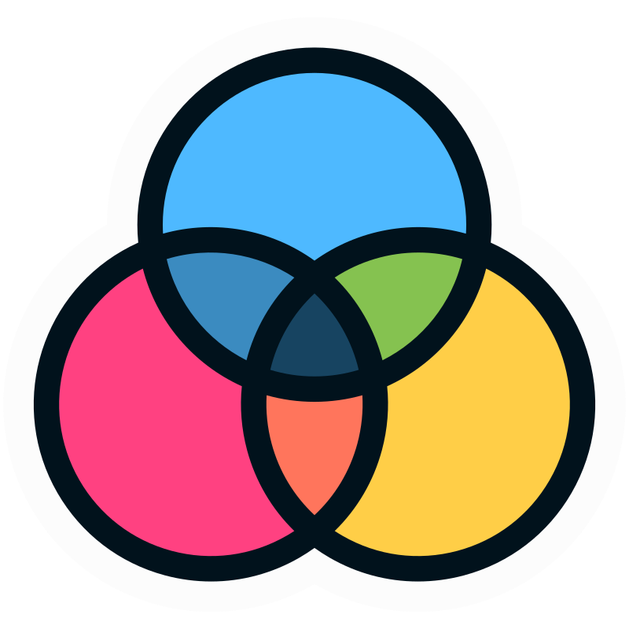

<h1> ColorCraft - Color Palette Generator </h1>

This is a minimal web app that generates a 5-color design palette based on a base color selected by the user. It's useful for designers and developers who need quick color systems for UI/UX, web apps, and branding.

## 🚀 Features

- 🎯 Choose a base color
- 🎨 Automatically generate:
  - **Primary** color
  - **Text** color
  - **Background** color
  - **Secondary background** color
  - **Secondary** color
- 🌈 Clean and intuitive UI
- ⚡ Built with plain HTML, CSS, and JavaScript (or update this if you used a framework)

## 🌈 Generate Your Palette

Tap into instant color harmony — test the app now:
🎨 [Create a Palette](https://yasinc2.github.io/ColorCraft-Color-Palette-Generator/)

## 💡 How It Works

1. User selects a base color.
2. The app calculates appropriate text, background, and secondary shades.
3. Results are displayed instantly with copyable color codes.

## 📜 License

MIT License — feel free to use, modify, and share.
